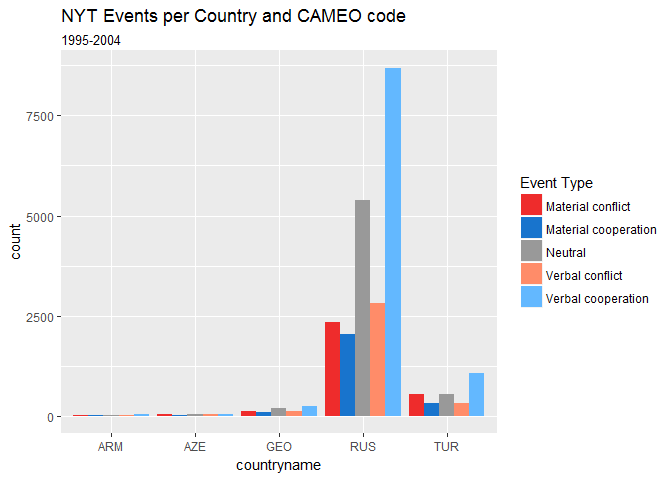
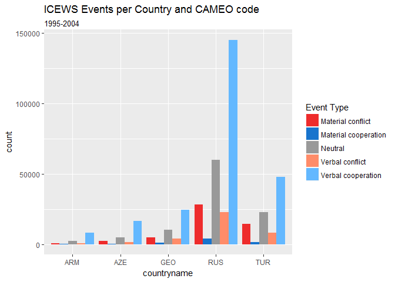

Mark\_SODA\_502\_Tutorial\_Part\_1
================
Mark Simpson
October 29, 2017

Today I'm going to show you how to make a few simple plots in R using the [Integrated Crisis Early Warning (ICEWS)](https://www.lockheedmartin.com/us/products/W-ICEWS.html) and [Phoenix](http://phoenixdata.org/) event datasets, which were automatically generated from news reports and coded according to a common scheme ([CAMEO](http://eventdata.parusanalytics.com/data.dir/cameo.html)). Since we're dealing with visualization in this tutorial, I should point out ICEWS has [one of the worst logos](https://www.lockheedmartin.com/content/lockheed/us/products/W-ICEWS/_jcr_content/center_content/image.img.png/1458325645114.png) I've ever seen.

### The Point

Overall, our goal is to generally compare ICEWS and Phoenix datasets for geographic and temporal coverage, to see if there are any apparent differences that are worth further investigation. To do this, I am creating a series of time series plots as well as event maps. I have split up this tutorial, and will cover maps in Part 2.

For the sake of this tutorial, I created a subset of the datasets that only contains geolocated events in 5 countries in the Caucasus region: *Russia, Georgia, Azerbaijan, Armenia,* and *Turkey*. ICEWS had to be subset even farther, and we are using a random 30% sample of the full data for those countries.

Note that Phoenix actually consists of three different subsets, New York Times (NYT), BBC Summary of World Broadcasts (SWB), and CIA Foreign Broadcast Information Service (FBIS), while ICEWS is one single dataset, albeit very large. I am keeping the Phoenix datasets dis-aggregated because we are interested in any large differences between those sources that might bias some analysis if it assumed they were the same.

First, to load the data and do just a little processing with *dplyr*

``` r
#### Read Datasets ####
library(dplyr, suppressPackageStartupMessages(TRUE))

# NYT
NYT <- read.csv(file ="data/NYT.csv") %>%
  mutate(date = as.Date(date)) %>%
  mutate(Dataset = "NYT")

# SWB
SWB<- read.csv(file ="data/SWB.csv") %>%
  mutate(date = as.Date(date)) %>%
  mutate(Dataset = "SWB")

# FBIS
FBIS <- read.csv(file ="data/FBIS.csv") %>%
  mutate(date = as.Date(date)) %>%
  mutate(Dataset = "FBIS")

# ICEWS
ICEWS <- read.csv(file ="data/ICEWS.csv") %>%
  mutate(date = as.Date(date)) %>%
  mutate(Dataset = "ICEWS") %>%
  rename(cameo.root = quad_class)
```

Plotting with *ggplot2*
-----------------------

*ggplot2* is both beautiful and terrible. It can produce very nice graphics, but is not super user friendly. It's is based off the idea of "grammar of graphics," which is theoretically elegant way of dividing plots into data, visible geometry ("geoms"), and a coordinate system, but is so deep it can be easy to get lost.

Coming from the default plotting in *R*, the biggest difference functionally and conceptually is that *ggplots* are built by stacking a series of functions on top of an initial plot function, which does not display anything by itself. These additional functions are either geoms, which actually indicate how the data is to be displayed (i.e., `geom_bar` displays a bar graph), or functions that manipulate some other aspect of the graphic, such as manually setting the colors or axis titles (e.g. `ggtitle`).

### The Noble Barchart

Everybody loves bar charts, so let's start there. For us, it would be useful to compare the total number of events per country. We need to pass *ggplot* the data (let's start with the NYT data), tell it our visual mapping in `aes()` (read: "aesthetics"), with countries on the x axis, and then tell it what kind of geometry to make (with `geom_bar`). We can then add a title to top it off. We don't need to map y in this case because `geom_bar` will generate the y axis (count) implicitly.

``` r
library(ggplot2, suppressPackageStartupMessages(TRUE))

ggplot(NYT, aes(x = countryname)) + 
     geom_bar() +
     ggtitle("NYT Events per Country")
```


Not a huge surprise, Russia (RUS) contains many more events than any other country.

### Histogram basics

Since we are interesting in the distribution of events over time, let's make some histograms showing how many events over time there are in the NYT data.

``` r
# Take a look at the fields
colnames(NYT)
```

    ##  [1] "eid"           "story_date"    "year"          "month"        
    ##  [5] "day"           "source"        "source_root"   "source_agent" 
    ##  [9] "source_others" "target"        "target_root"   "target_agent" 
    ## [13] "target_others" "code"          "root_code"     "quad_class"   
    ## [17] "goldstein"     "joined_issues" "lat"           "lon"          
    ## [21] "placename"     "statename"     "countryname"   "aid"          
    ## [25] "process"       "date"          "cameo.root"    "Dataset"

``` r
# NYT data, aes (aesthetic) sets date field as x
ggplot(NYT, aes(x = date)) + 
  
  # set binwidth to cover 100 days/dates
  geom_histogram( binwidth = 100)
```


That's cool, but is still missing some important features like a title, and the aesthetic mapping could be better. The following is the type of customization you can do within ggplot. First, we can change the will with `fill = "dodgerblue3"`, "dodgerblue3" being one of the named colors in *R*. We can use `scale_x_date`, a specialized *ggplot* function to modify the display of dates, changing the breaks and the format of the date label itself to years. Here we are letting *ggplot* figure out the limits automatically, which is important to realize since our data sets have different temporal coverage. We can then change the label text to be more descriptive, and give the plot a title. Then, we can use theme to do a little formatting on the text elements to make them larger and more readable.

Here is what that all looks like, put together:

``` r
# NYT data, aes (aesthetic) sets date field as x
ggplot(NYT, aes(x = date)) + 
  
  # set binwidth to cover 100 days
  geom_histogram(binwidth = 100,
           fill = "dodgerblue3") +
  
  # Change the breaks for the labels to better cover the area
  scale_x_date(date_breaks = "5 years",
               date_minor_breaks = "1 year",
               date_labels = "%Y") +
  
  # Change the labels to be a little intuitive
  labs( title = "Phoenix NYT Events per 100 days", 
        x = NULL,
        y = "100 Day Count") +
  
  # Make the fonts bigger, boldface the title
  theme( title = element_text(size = 14, face = "bold"),
         axis.text = element_text(size = 12) )
```


Note the two dips in the histogram, one in 1961, and another in 1978. Let's go ahead and zoom in on 1961 by changing our `scale_x_date` chunk to have a specific limit on the time period, and then reducing our `binwidth` to be finer-grained. *R* wants this as a *date* datatype, requiring us to call `as.Date` to do a quick transform. We can also manipulate the spacing of the dates to better fit the time period.

``` r
# NYT data, aes (aesthetic) sets date field as x
ggplot(NYT, aes(x = date)) + 
     
  #create histogram, set binwidth to cover 100 days, set blue
  geom_histogram(binwidth = 10,
           fill = "dodgerblue3") +
  
  # Set the limits to a specific time period
  scale_x_date(limits = c( as.Date("1960-01-01"), as.Date("1963-01-01")),
               date_breaks = "2 month",
               date_minor_breaks = "1 month",
               date_labels = "%y %b") +
     
  # Change the labels to be a little intuitive
  labs( title = " 1961 Phoenix NYT Events", 
        x = NULL,
        y = "10 Day Count") +
  
  # Note I changed the angle in element_text
  theme( title = element_text(size = 14, face = "bold"),
         axis.text = element_text( angle = 90) )
```


Hm, well that ain't right. That, or *nothing* happened for big chunks of 1961. Interestingly, this is also true for the entire NYT dataset, not just our country subset.

### Frequency Polgyons

This is just mapping the number of events over time, but we also have event types stored in the cameo.root field (Neutral, Verbal Cooperation/Conflict, and Material Cooperation/Conflict). Since we're dealing with this a lot, we can make a custom color scheme to keep them consistent across the plots. Otherwise, *ggplot* will assign colors.

To map these to any color, all we have to do is tell ggplot that we want color mapped to cameo.root in the initial `aes()` block. If we want custom colors, we can make a variable to store the color values, then assign them with `scale_color_manual`.

``` r
# Manually set colors for event types, called in ggmap later
event.color <- c("Neutral" = "gray60", 
          "Verbal cooperation" = "steelblue1",
          "Material cooperation"  = "dodgerblue3", 
          "Verbal conflict" = "salmon1", 
          "Material conflict" = "firebrick2")
```

We could try to plot the bar histograms like the total example, but since the data will overlap, the bars will cover each other up. It's better use use a line equivalent, which in this context is confusingly called a *frequency polygon*.

``` r
# Set as variable so we can modify titles + labels on the fly
binwidth <- 365

ggplot(NYT, aes(x = date, color = cameo.root)) + 
  
  # Use frequency polygon; expand binwidth to variable days, set transparent
  geom_freqpoly(binwidth = binwidth, alpha = .8, size = 1) +
  
  # Change the breaks to better cover the area
  scale_x_date(date_breaks = "10 years",
               date_minor_breaks = "1 year",
               date_labels = "%Y") +
  
  # Here is where we are assigning the colors we defined
  scale_color_manual(name = "Source", values = event.color) +
  
  # This resent the alpha to make the legend legible
  guides(color = guide_legend(override.aes = list(alpha = 1)) ) +
  
  # Change the labels to be a little intuitive
  labs( title = paste("Phoenix NYT Events per", binwidth, "days"), 
        x = NULL,
        y = paste(binwidth, "Day Count") ) +
  
  # Make the fonts bigger, boldface the title
  theme( title = element_text(size = 14, face = "bold"),
         axis.text = element_text(size = 12) )
```


Now that we have a graph set up, we can swap out variables to plot different aspects. Here instead of cameo.root, we use countryname. Of course, if we wanted to publish this we'd update the codes to full country names (more on that later!).

``` r
# swap out countryname in color
ggplot(NYT, aes(x = date, color = countryname)) + 
  
  # Use frequency polygon; expand binwidth to variable days, set transparent
  geom_freqpoly(binwidth = binwidth, alpha = .8, size = 1) +
  
  # Change the breaks to better cover the area
  scale_x_date(date_breaks = "10 years",
               date_minor_breaks = "1 year",
               date_labels = "%Y") +

  # This resent the alpha to make the legend legible
  guides(color = guide_legend(override.aes = list(alpha = 1))) +
  
  # Change the labels to be a little intuitive
  labs( title = paste("Phoenix NYT Events per Country", binwidth, "days"), 
        x = NULL,
        y = paste(binwidth, "Day Count") ) +
  
  # Make the fonts bigger, boldface the title
  theme( title = element_text(size = 14, face = "bold"),
         axis.text = element_text(size = 12) )
```


#### Extending Histograms to Other Datasets

We can naturally make graphs like this for the other datasets. Note I am manually updating the color and the title for the total graph.

ggplot calls can get obnoxiously long and difficult to comment, so many people store the plot as a variable, then modify it through the variable. I don't do this as much, but it is very common to see in official and unofficial documentation. Here I just do it for the first plot. Note that rmarkdown automagically generates the plot even if stored in a variable, but in R Studio you would not see a plot if it is stored and not called.

First, SWB:

``` r
# Store plot in a variable, then add to it
base <- ggplot(SWB, aes(x = date)) +
  
  # set binwidth to cover 100 days, set transparent, blue
  geom_histogram(binwidth = 100,
           fill = "darkorchid") +

  # Change the breaks to better cover the area
  scale_x_date(date_breaks = "5 years",
               date_minor_breaks = "1 year",
               date_labels = "%Y") +
  
  # Change the labels to be a little intuitive
  labs( title = "Phoenix SWB Events per 100 days", 
        x = NULL,
        y = "100 Day Count") +
  
  # Make the fonts bigger, boldface the title
  theme( title = element_text(size = 14, face = "bold"),
         axis.text = element_text(size = 12) )
```

And now we can just call the plot object to get it to plot:

``` r
# Call the plot object to actually plot
base
```


Now to repeat the event type plots we made with the NYT to a different dataset.

``` r
# Start plot
ggplot(SWB, aes(x = date, color = cameo.root)) + 
  
  # Expand binwidth to variable days, set transparent
  geom_freqpoly(binwidth = binwidth, alpha = .8, size = 1) +
  
  # Change the breaks to better cover the area
  scale_x_date(date_breaks = "5 years",
               date_minor_breaks = "1 year",
               date_labels = "%Y") +
  
  # Here is where we are assigning the colors we defined
  scale_color_manual(name = "Event Type", values = event.color) +
  
  # This resent the alpha to make the legend legible
  guides(color = guide_legend(override.aes = list(alpha = 1)))+
  
  # Change the labels to be a little intuitive
  labs( title = paste("Phoenix SWB Events per", binwidth, "days"), 
        x = NULL,
        y = paste(binwidth, "Day Count") ) +
  
  # Make the fonts bigger, boldface the title
  theme( title = element_text(size = 14, face = "bold"),
         axis.text = element_text(size = 12) )
```


Now for the FBIS data:

``` r
# Start plot
ggplot(FBIS, aes(x = date)) + 
  
  # set binwidth to cover 100 days, set transparent, blue
  geom_histogram(binwidth = 100,
           fill = "cyan4") +
  
  # Change the breaks to better cover the area
  scale_x_date(date_breaks = "5 years",
               date_minor_breaks = "1 year",
               date_labels = "%Y") +
  
  # Change the labels to be a little intuitive
  labs( title = "Phoenix FBIS Events per 100 days", 
        x = NULL,
        y = "100 Day Count") +
  
  # Make the fonts bigger, boldface the title
  theme( title = element_text(size = 14, face = "bold"),
         axis.text = element_text(size = 12) )
```


Notice that there are some spurious evens lurking somewhere significantly before coverage nominally starts. Instead of zooming in graphically, we can just apply a simple filter.

``` r
# dplyr filter on date
FBIS %>% filter(date < "1995-01-01")
```

    ##           eid story_date year month day    source source_root source_agent
    ## 1 FBIS0296242 01/01/1970 1970     1   1       USA         USA             
    ## 2 FBIS0629798 01/01/1970 1970     1   1 RUSBUSGOV         RUS          BUS
    ## 3 FBIS0650162 01/01/1970 1970     1   1       RUS         RUS             
    ## 4 FBIS0660099 01/01/1970 1970     1   1    RUSGOV         RUS          GOV
    ## 5 FBIS0717228 01/01/1970 1970     1   1    TURREB         TUR          REB
    ## 6 FBIS0722834 01/01/1970 1970     1   1    ---GOV                      GOV
    ## 7 FBIS0723769 01/01/1970 1970     1   1 MEAREBUAF                      REB
    ##   source_others    target target_root target_agent target_others code
    ## 1                  AZEELI         AZE                        ELI   40
    ## 2           GOV    RUSGOV         RUS          GOV                 31
    ## 3                  ---MIL                      MIL                 31
    ## 4               RUSBUSGOV         RUS          BUS           GOV   31
    ## 5                     TUR         TUR                              80
    ## 6                     TUR         TUR                              42
    ## 7           UAF    IRQMIL         IRQ          MIL                 20
    ##   root_code quad_class goldstein                joined_issues      lat
    ## 1         4          1       1.0                              40.37767
    ## 2         3          1       5.2                              60.00000
    ## 3         3          1       5.2                              60.00000
    ## 4         3          1       5.2                              60.00000
    ## 5         8          2       5.0                     TERROR,1 39.00000
    ## 6         4          1       1.9                              39.00000
    ## 7         2          0       3.0 TERROR,1;SECURITY_SERVICES,1 37.24379
    ##         lon          placename statename countryname     aid  process
    ## 1  49.89201               Baku                   AZE 6238547 FBIS__v1
    ## 2 100.00000 Russian Federation                   RUS 3331128 FBIS__v1
    ## 3 100.00000 Russian Federation                   RUS 3331128 FBIS__v1
    ## 4 100.00000 Russian Federation                   RUS 3331128 FBIS__v1
    ## 5  35.00000 Republic of Turkey                   TUR 5309643 FBIS__v1
    ## 6  35.00000 Republic of Turkey                   TUR 6044217 FBIS__v1
    ## 7  42.46345             Silopi                   TUR 6656860 FBIS__v1
    ##         date           cameo.root Dataset
    ## 1 1970-01-01   Verbal cooperation    FBIS
    ## 2 1970-01-01   Verbal cooperation    FBIS
    ## 3 1970-01-01   Verbal cooperation    FBIS
    ## 4 1970-01-01   Verbal cooperation    FBIS
    ## 5 1970-01-01 Material cooperation    FBIS
    ## 6 1970-01-01   Verbal cooperation    FBIS
    ## 7 1970-01-01              Neutral    FBIS

This of course looks suspiciously like something happened in data creation, since there are only seven events before 1995, and they are all on January 1, 1970. Let's manually change our date range and re-plot to exclude these spurious values.

``` r
# Start plot
ggplot(FBIS, aes(x = date)) + 
  
     # set binwidth to cover 100 days, set transparent, blue
     geom_histogram(binwidth = 100,
          fill = "cyan4") +
     
     # Rescale date to fit the data
     scale_x_date(limits = c(as.Date("1995-01-01"), as.Date("2004-01-01")), 
          date_breaks = "1 year",
          date_minor_breaks = "1 year",
          date_labels = "%Y") +
     
     # Change the labels to be a little intuitive
     labs( title = "Phoenix FBIS Events per 100 days", 
          x = NULL,
          y = "100 Day Count") +
     
     # Make the fonts bigger, boldface the title
     theme( title = element_text(size = 14, face = "bold"),
          axis.text = element_text(size = 12) )
```


Since FBIS doesn't cover that long of a period, it would be more appropriate to select a smaller binwidth.

``` r
#### FBIS by Type, binwidth 365 ####

ggplot(FBIS, aes(x = date, color = cameo.root)) + 
  
  # Expand binwidth to variable days, set transparent
  geom_freqpoly(binwidth = binwidth, alpha = .8, size = 1) +
  
     # Rescale date to fit the data
  scale_x_date(limits = c(as.Date("1995-01-01"), as.Date("2004-01-01")), 
          date_breaks = "1 years",
          date_minor_breaks = "1 year",
          date_labels = "%Y") +
  
  # Here is where we are assigning the colors we defined
  scale_color_manual(name = "Source", values = event.color) +
  
  # This resent the alpha to make the legend legible
  guides(color = guide_legend(override.aes = list(alpha = 1)))+
  
  # Change the labels to be a little intuitive
  labs( title = paste("Phoenix FBIS Events per", 10, "days"), 
        x = NULL,
        y = paste(binwidth, "Day Count") ) +
  
  # Make the fonts bigger, boldface the title
  theme( title = element_text(size = 14, face = "bold"),
         axis.text = element_text(size = 12) )
```


``` r
#### FBIS by Type, binwidth 10 ####
 
# Set new binwidth
binwidth <- 10

ggplot(FBIS, aes(x = date, color = cameo.root)) + 
  
  # Set binwidth to 10, set transparent
  geom_freqpoly(binwidth = binwidth, alpha = .8, size = 1) +
  
     # Rescale date to fit the data
  scale_x_date(limits = c(as.Date("1995-01-01"), as.Date("2004-01-01")), 
          date_breaks = "1 years",
          date_minor_breaks = "1 year",
          date_labels = "%Y") +
  
  # Here is where we are assigning the colors we defined
  scale_color_manual(name = "Source", values = event.color) +
  
  # This resent the alpha to make the legend legible
  guides(color = guide_legend(override.aes = list(alpha = 1)))+
  
  # Change the labels to be a little intuitive
  labs( title = paste("Phoenix FBIS Events per", binwidth, "days"), 
        x = NULL,
        y = paste(binwidth, "Day Count") ) +
  
  # Make the fonts bigger, boldface the title
  theme( title = element_text(size = 14, face = "bold"),
         axis.text = element_text(size = 12) )
```


``` r
# Set binwidth back to 365
binwidth <- 365
```

Note the effect binwidth has on how "smooth" data appears. Smooth might be good for figures in publications, but note the bige chunkes of missing data in 2002 (also visible in the above histogram)

Finally, ICEWS.

``` r
# Start Plot
ggplot(ICEWS, aes(x = date)) + 
  
  # set binwidth to cover 100 days, set transparent, blue
  geom_histogram(binwidth = 100,
           fill = "firebrick") +
  
  # Change the breaks to better cover the area
  scale_x_date(date_breaks = "5 years",
               date_minor_breaks = "1 year",
               date_labels = "%Y") +
  
  # Change the labels to be a little intuitive
  labs( title = "ICEWS Events per 100 days", 
        x = NULL,
        y = "100 Day Count") +
  
  # Make the fonts bigger, boldface the title
  theme( title = element_text(size = 14, face = "bold"),
         axis.text = element_text(size = 12) )
```


``` r
#### ICEWS by Type ####

# Set binwidth again
binwidth <- 100

ggplot(ICEWS, aes(x = date, color = cameo.root)) + 
  
  # Expand binwidth to variable days, set transparent
  geom_freqpoly(binwidth = binwidth, alpha = .8, size = 1) +
  
  # Change the breaks to better cover the area
  scale_x_date(date_breaks = "5 years",
               date_minor_breaks = "1 year",
               date_labels = "%Y") +
  
  # Here is where we are assigning the colors we defined
  scale_color_manual(name = "Source", values = event.color) +
  
  # This resent the alpha to make the legend legible
  guides(color = guide_legend(override.aes = list(alpha = 1)))+
  
  # Change the labels to be a little intuitive
  labs( title = paste("ICEWS Events per", binwidth, "days"), 
        x = NULL,
        y = paste(binwidth, "Day Count") ) +
  
  # Make the fonts bigger, boldface the title
  theme( title = element_text(size = 14, face = "bold"),
         axis.text = element_text(size = 12) )
```


### Plotting Multiple Datasets

These illustrate the distribution of each of the datasets over time, but we have to keep in mind the axes are changing depending on the data, so while we get a good view of the internal variation, we can't see how the datasets compare to one another.

The preferable approach for ggplot is to format your data to death before plotting, such as aggregating all the data you want to plot into a single data frame, like how we have the event type stored within a field. However, it is possible to over-plot separate data sources onto a single ggplot, it just takes a little bit of effort. *ggplot* can be called with an empty data frame, and the data designated for each of the geometry functions separately.

Here I am also storing the plot separately because I want to make a version with a different date scale.

``` r
# store our color scheme for the different sources
source.color <- c("NYT" = "dodgerblue3", 
             "SWB" = "darkorchid",
             "FBIS" = "cyan4", 
             "ICEWS" = "firebrick")

# Start plot with empty data frame, since we'll add the data separately , store for later
base.plot <-  ggplot(data.frame(), aes(color = source.color)) + 
  
  # NYT
  geom_freqpoly(data = NYT, aes(x=date, color = "NYT"), 
                binwidth = 100,
                size = 1.2,
                alpha = .6, show.legend = TRUE) +
  
  # SWB
  geom_freqpoly(data = SWB, aes(x=date, color = "SWB"), 
                binwidth = 100,
                size = 1.2,
                alpha = .6) +
  
  # FBIS
  geom_freqpoly(data = FBIS, aes(x=date, color = "FBIS"), 
                binwidth = 100,
                size = 1.2,
                alpha = .6) +
  
  # ICEWS
  geom_freqpoly(data = ICEWS, aes(x=date, color = "ICEWS"), 
                binwidth = 100,
                size = 1.2,
                alpha = .6) +

  # Here is where we are assigning the colors we defined
  scale_color_manual(name = "Source", values = source.color) +
  
  # This resent the alpha to make the legend legible
  guides(color = guide_legend(override.aes = list(alpha = 1)))+
  
  # Change the labels to be a little intuitive
  labs( title = "Events Over Time", 
        x = NULL,
        y = "100 Day Count") +

  # Make the fonts bigger, boldface the title
  theme( title = element_text(size = 14, face = "bold"),
         axis.text = element_text(size = 12) ) +
     
  scale_x_date(date_breaks = "5 years",
               date_minor_breaks = "1 year",
               date_labels = "%Y") 

# Call the plot
base.plot
```


It would also make sense to look at the same plot, but only for the dates where there is significant overlap. Since we are especially interested in how ICEWS stacks up, we will start when it starts, 1995. We can add to or override the previously set parameters, and *ggplot* will warn you if a value is changed. Check out the warnings for all the data being excluded, too, which happens often when you manually change the scale rather than filter the data beforehand.

``` r
  ## Changed the start date, WHOOOO!!  
  base.plot + 
  scale_x_date(limits = c(as.Date("1995-01-01"), NA), 
               date_breaks = "2 year",
               date_minor_breaks = "1 year",
               date_labels = "%Y")
```

    ## Scale for 'x' is already present. Adding another scale for 'x', which
    ## will replace the existing scale.

    ## Warning: Removed 22383 rows containing non-finite values (stat_bin).

    ## Warning: Removed 26039 rows containing non-finite values (stat_bin).

    ## Warning: Removed 7 rows containing non-finite values (stat_bin).

    ## Warning: Removed 2 rows containing missing values (geom_path).

    ## Warning: Removed 2 rows containing missing values (geom_path).

    ## Warning: Removed 2 rows containing missing values (geom_path).

    ## Warning: Removed 2 rows containing missing values (geom_path).


We can also subset the data within the plot calls, which lets us make a comparison according to that subset between the datasets. In this case, I am only looking at the total number of "Neutral" events across the different datasets.

``` r
# Start plot with empty data frame, since we'll add the data separately , store for later
base.plot <-  ggplot(data.frame(), aes(color = source.color)) + 
  
  # NYT
  geom_freqpoly(data = NYT[NYT$cameo.root == "Neutral",], aes(x=date, color = "NYT"), 
                binwidth = 100,
                size = 1.2,
                alpha = .6, show.legend = TRUE) +
  
  # SWB
  geom_freqpoly(data = SWB[SWB$cameo.root == "Neutral",], aes(x=date, color = "SWB"), 
                binwidth = 100,
                size = 1.2,
                alpha = .6) +
  
  # FBIS
  geom_freqpoly(data = FBIS[FBIS$cameo.root == "Neutral",], aes(x=date, color = "FBIS"), 
                binwidth = 100,
                size = 1.2,
                alpha = .6) +
  
  # ICEWS: Note cameo field name is different
  geom_freqpoly(data = ICEWS[ICEWS$cameo.root == "Neutral",], aes(x=date, color = "ICEWS"), 
                binwidth = 100,
                size = 1.2,
                alpha = .6) +

  # Here is where we are assigning the colors we defined
  scale_color_manual(name = "Source", values = source.color) +
  
  # This resent the alpha to make the legend legible
  guides(color = guide_legend(override.aes = list(alpha = 1)))+
  
  # Change the labels to be a little intuitive
  labs( title = "Neutral Events Over Time: Dataset Comparison", 
        x = NULL,
        y = "100 Day Count") +

  # Make the fonts bigger, boldface the title
  theme( title = element_text(size = 14, face = "bold"),
         axis.text = element_text(size = 12) ) +

  # Limit date range
  scale_x_date(limits = c(as.Date("1995-01-01"), NA), 
               date_breaks = "2 year",
               date_minor_breaks = "1 year",
               date_labels = "%Y") 

# Call the plot
base.plot
```


Bar Charts Revisited
--------------------

Since we can see a big difference over time with different event types, we can also look to see how the totals compare by modifying the simple bar chart we made at the beginning. Let's start with NYT again. By mapping cameo.root to `fill`, *ggplot* automatically groups by that variable, with the fill mapped to colors, which we then override. In this context, it would make more sense to have the bars side by side so it's easier to compare total counts, which is the `dodge` option within `geom_bar`.

Since we are dealing with very different temporal coverage, let's look at the area of maximum overlap, 1995-2004.

``` r
ggplot(NYT[NYT$date > "1995-01-01" | NYT$date < "2005-01-01", ], 
       aes(x = countryname, 
           fill = cameo.root)) + 
     geom_bar(position = "dodge") +  
     
     # Here is where we are assigning the colors we defined
     scale_fill_manual(name = "Event Type", values = event.color) +
  
  # This resent the alpha to make the legend legible
     guides(color = guide_legend(override.aes = list(alpha = 1))) +
     
     ggtitle("NYT Events per Country and CAMEO code",
             subtitle = "1995-2004")
```



Now compare this to the totals within ICEWS:

``` r
ggplot(ICEWS[ICEWS$date > "1995-01-01" | ICEWS$date < "2005-01-01", ], 
       aes(x = countryname, 
           fill = cameo.root)) + 
     geom_bar(position = "dodge") +  
     
     # Here is where we are assigning the colors we defined
     scale_fill_manual(name = "Event Type", values = event.color) +
  
  # This resent the alpha to make the legend legible
     guides(color = guide_legend(override.aes = list(alpha = 1))) +
     
     ggtitle("ICEWS Events per Country and CAMEO code",
             subtitle = "1995-2004")
```



Interestingly, NYT coverage is much more concentrated on Turkey and Russia, where ICEWS has more events in smaller countries proportionally. The type of events captured is also different, with relatively fewer Material Cooperation events in ICEWS.

Conclusions
-----------

Boy, graphs sure are neat, and can show us some interesting patterns within the data can than guide further analysis.

Jump over to **Part 2** of this tutorial so see some mapping in action.
