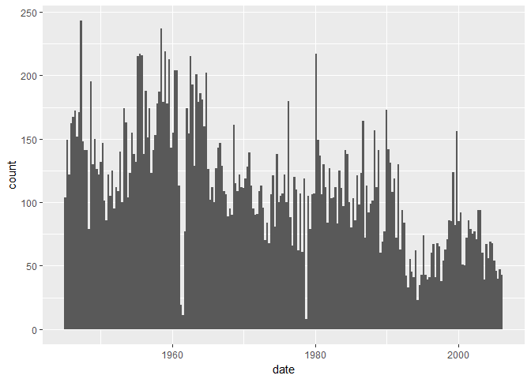
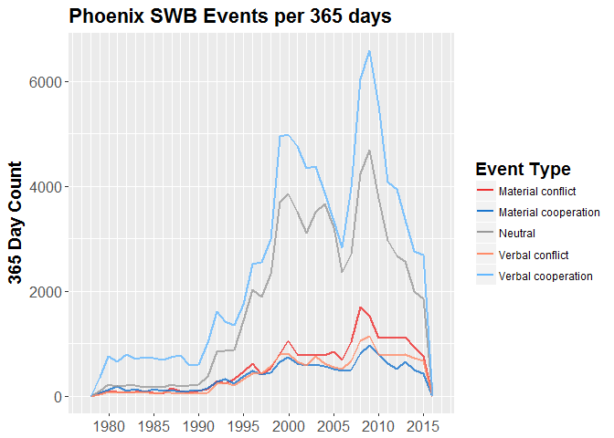

Mark\_SODA\_502\_Tutorial\_Part\_1
================
Mark Simpson
October 29, 2017

Today I'm going to show you how to make a few simple plots in R using the ICEWS and Phoenix event datasets. For the sake of this tutorial, I created a subset of the datasets that only contains 5 countries in the Caucasus region: Russia, Georgia, Azerbaijan, Armenia, and Turkey.

Note that Phoenix actually consists of three different subsets, New York Times (NYT), BBC Summary of World Broadcasts (SWB), and CIA Foreign Broadcast Information Service (FBIS), while Integrated Crisis Early Warning (ICEWS) is one single dataset.

First, to load the data and do just a little processing with *dplyr*

``` r
#### Read Datasets ####

# NYT
NYT <- read.csv(file ="data/NYT.csv") %>%
  mutate(date = as.Date(date)) %>%
  mutate(Dataset = "NYT")

# SWB
SWB<- read.csv(file ="data/SWB.csv") %>%
  mutate(date = as.Date(date)) %>%
  mutate(Dataset = "SWB")

# FBIS
FBIS <- read.csv(file ="data/FBIS.csv") %>%
  mutate(date = as.Date(date)) %>%
  mutate(Dataset = "FBIS")

# ICEWS
ICEWS <- read.csv(file ="data/ICEWS.csv") %>%
  mutate(date = as.Date(date)) %>%
  mutate(Dataset = "ICEWS")
```

Plotting with *ggplot2*
-----------------------

*ggplot2* is both beautiful and terrible. It can produce very nice graphics, but is not super user friendly. *ggplot2* is based off the idea of "grammar of graphics," which is theoretically elegant way of dividing plots into data, visible geometry, and a coordinate system, but is so deep it can be easy to get lost.

### Histogram basics

Anyway, let's start with a basic histogram showing how many events over time there are in the NYT data. For this, we need to pass ggplot the data, tell it our visual mapping (date should be on the x axis), and then tell it what kind of geometry to make (with a separate function). Also note that y is implicit with a histogram, since it generates the y axis (count).

``` r
library(ggplot2, suppressPackageStartupMessages(TRUE))

# Take a look at the fields
colnames(NYT)
```

    ##  [1] "eid"           "story_date"    "year"          "month"        
    ##  [5] "day"           "source"        "source_root"   "source_agent" 
    ##  [9] "source_others" "target"        "target_root"   "target_agent" 
    ## [13] "target_others" "code"          "root_code"     "quad_class"   
    ## [17] "goldstein"     "joined_issues" "lat"           "lon"          
    ## [21] "placename"     "statename"     "countryname"   "aid"          
    ## [25] "process"       "date"          "cameo.root"    "Dataset"

``` r
# NYT data, aes (aesthetic) sets date field as x
ggplot(NYT, aes(x = date)) + 
  
  # set binwidth to cover 100 days
  geom_histogram( binwidth = 100)
```



That's cool, but is still missing some important features like a title, and the aesthetic mapping could be better. The following is the type of customization you can do within ggplot. Note that scale\_x\_date is a specialized ggplot function to modify the display of dates, pretty crazy. Here we are letting ggplot figure out the limits itself, which is important to realize since our datasets have different temporal coverage.

``` r
ggplot(NYT, aes(x = date)) + 
  
  # set binwidth to cover 100 days, set transparent, blue
  geom_histogram(binwidth = 100,
           fill = "dodgerblue3") +
  
  # Change the breaks for the labels to better cover the area
  scale_x_date(date_breaks = "5 years",
               date_minor_breaks = "1 year",
               date_labels = "%Y") +
  
  # Change the labels to be a little intuitive
  labs( title = "Phoenix NYT Events per 100 days", 
        x = NULL,
        y = "100 Day Count") +
  
  # Make the fonts bigger, boldface the title
  theme( title = element_text(size = 14, face = "bold"),
         axis.text = element_text(size = 12) )
```


Note the two dips, one in 1961, and another in 1978. Let's go ahead and zoom in on 1961 by changing our `scale_x_date` chunk to have a specific limit on the time period, and then reducing our `binwidth` to be finer-grained. Note that R wants this as a *date* datatype, requiring us to call `as.Date` to do a quick transform. We can also manipulate the spacing of the dates to better fit the time period.

``` r
ggplot(NYT, aes(x = date)) + 
  
  # set binwidth to cover 100 days, set transparent, blue
  geom_histogram(binwidth = 10,
           fill = "dodgerblue3") +
  
  # Set the limits to a specific time period
  scale_x_date(limits = c(as.Date("1960-01-01"), as.Date("1963-01-01") ), 
               date_breaks = "1 month",
               date_minor_breaks = "1 month",
               date_labels = "%y %b") +
     
  # Change the labels to be a little intuitive
  labs( title = " 1961 Phoenix NYT Events", 
        x = NULL,
        y = "10 Day Count") +
  
  # Note I changed the angle in element_text
  theme( title = element_text(size = 14, face = "bold"),
         axis.text = element_text( angle = 90) )
```


Hm, well that ain't right. That, or nothing happened for big chunks of 1961.

### Frequency Polgyons

This is just mapping the number of events over time, but we also have event types stored in the cameo.root field (Neutral, Verbal Cooperation/Conflict, and Material Cooperation/Conflict). Since we're dealing with this a lot, we can make a custom color scheme to keep them consistent across the plots. Otherwise, *ggplot* will assign colors.

To map these to any color, all we have to do is tell ggplot that we want color mapped to cameo.root in the initial `aes()` block. If we want custom colors, we can make a variable to store the color values, then assign them with `scale_color_manual`

``` r
# Manually set colors for event types, called in ggmap later
event.color <- c("Neutral" = "gray60", 
          "Verbal cooperation" = "steelblue1",
          "Material cooperation"  = "dodgerblue3", 
          "Verbal conflict" = "salmon1", 
          "Material conflict" = "firebrick2")
```

We could try to plot the bar histograms like the total example, but since the data will overlap, the bars will cover each other up. It's better use use a line equivalent, which in this context is confusingly called a *frequency polygon*.

``` r
# Set as variable so we can modify titles + labels on the fly
binwidth <- 365

ggplot(NYT, aes(x = date, color = cameo.root)) + 
  
  # Use frequency polygon; expand binwidth to variable days, set transparent
  geom_freqpoly(binwidth = binwidth, alpha = .8, size = 1) +
  
  # Change the breaks to better cover the area
  scale_x_date(date_breaks = "10 years",
               date_minor_breaks = "1 year",
               date_labels = "%Y") +
  
  # Here is where we are assigning the colors we defined
  scale_color_manual(name = "Source", values = event.color) +
  
  # This resent the alpha to make the legend legible
  guides(color = guide_legend(override.aes = list(alpha = 1)))+
  
  # Change the labels to be a little intuitive
  labs( title = paste("Phoenix NYT Events per", binwidth, "days"), 
        x = NULL,
        y = paste(binwidth, "Day Count") ) +
  
  # Make the fonts bigger, boldface the title
  theme( title = element_text(size = 14, face = "bold"),
         axis.text = element_text(size = 12) )
```


#### Extending Histograms to Other Datasets

We can naturally make graphs like this for the other datasets. Note I am manually updating the color and the title for the total graph.

ggplot calls can get obnoxiously long and difficult to comment, so many people store the plot as a variable, then modify it through the variable. I don't do this as much, but it is very common to see in official and unofficial documentation. Here I just do it for the first plot. Note that rmarkdown automagically generates the plot even if stored in a variable, but in R Studio you would not see a plot if it is stored and not called.

First, SWB:

``` r
#### Total SWB ####

# Store plot in a variable, then add to it
base <- ggplot(SWB, aes(x = date)) +
  
  # set binwidth to cover 100 days, set transparent, blue
  geom_histogram(binwidth = 100,
           fill = "darkorchid") 
  
  # Change the breaks to better cover the area
base + scale_x_date(date_breaks = "5 years",
               date_minor_breaks = "1 year",
               date_labels = "%Y") +
  
  # Change the labels to be a little intuitive
  labs( title = "Phoenix SWB Events per 100 days", 
        x = NULL,
        y = "100 Day Count") +
  
  # Make the fonts bigger, boldface the title
  theme( title = element_text(size = 14, face = "bold"),
         axis.text = element_text(size = 12) )
```

    ## Warning: Removed 111 rows containing non-finite values (stat_bin).


And now we can just call the plot object to get it to plot:

``` r
# Call the plot object to actually plot
base
```

    ## Warning: Removed 111 rows containing non-finite values (stat_bin).


Now to repeat the vent type plots we made with the NYT to a different dataset.

``` r
#### SWB by Type ####

# Start plot
ggplot(SWB, aes(x = date, color = cameo.root)) + 
  
  # Expand binwidth to variable days, set transparent
  geom_freqpoly(binwidth = binwidth, alpha = .8, size = 1) +
  
  # Change the breaks to better cover the area
  scale_x_date(date_breaks = "5 years",
               date_minor_breaks = "1 year",
               date_labels = "%Y") +
  
  # Here is where we are assigning the colors we defined
  scale_color_manual(name = "Source", values = event.color) +
  
  # This resent the alpha to make the legend legible
  guides(color = guide_legend(override.aes = list(alpha = 1)))+
  
  # Change the labels to be a little intuitive
  labs( title = paste("Phoenix SWB Events per", binwidth, "days"), 
        x = NULL,
        y = paste(binwidth, "Day Count") ) +
  
  # Make the fonts bigger, boldface the title
  theme( title = element_text(size = 14, face = "bold"),
         axis.text = element_text(size = 12) )
```



Now for the FBIS data- notice that there is a spurious event lurking somewhere significantly before coverage actually starts.

``` r
#### Total FBIS ####

# Start plot
ggplot(FBIS, aes(x = date)) + 
  
  # set binwidth to cover 100 days, set transparent, blue
  geom_histogram(binwidth = 100,
           fill = "cyan4") +
  
  # Change the breaks to better cover the area
  scale_x_date(date_breaks = "5 years",
               date_minor_breaks = "1 year",
               date_labels = "%Y") +
  
  # Change the labels to be a little intuitive
  labs( title = "Phoenix FBIS Events per 100 days", 
        x = NULL,
        y = "100 Day Count") +
  
  # Make the fonts bigger, boldface the title
  theme( title = element_text(size = 14, face = "bold"),
         axis.text = element_text(size = 12) )
```


``` r
#### FBIS by Type ####

ggplot(FBIS, aes(x = date, color = cameo.root)) + 
  
  # Expand binwidth to variable days, set transparent
  geom_freqpoly(binwidth = binwidth, alpha = .8, size = 1) +
  
  # Change the breaks to better cover the area
  scale_x_date(date_breaks = "5 years",
               date_minor_breaks = "1 year",
               date_labels = "%Y") +
  
  # Here is where we are assigning the colors we defined
  scale_color_manual(name = "Source", values = event.color) +
  
  # This resent the alpha to make the legend legible
  guides(color = guide_legend(override.aes = list(alpha = 1)))+
  
  # Change the labels to be a little intuitive
  labs( title = paste("Phoenix FBIS Events per", binwidth, "days"), 
        x = NULL,
        y = paste(binwidth, "Day Count") ) +
  
  # Make the fonts bigger, boldface the title
  theme( title = element_text(size = 14, face = "bold"),
         axis.text = element_text(size = 12) )
```


Finally, ICEWS. Note that the field names in ICEWS are different (`CAMEO.root` vs `cameo.root`).

``` r
#### Total ICEWS ####

# Start Plot
ggplot(ICEWS, aes(x = date)) + 
  
  # set binwidth to cover 100 days, set transparent, blue
  geom_histogram(binwidth = 100,
           fill = "firebrick") +
  
  # Change the breaks to better cover the area
  scale_x_date(date_breaks = "5 years",
               date_minor_breaks = "1 year",
               date_labels = "%Y") +
  
  # Change the labels to be a little intuitive
  labs( title = "ICEWS Events per 100 days", 
        x = NULL,
        y = "100 Day Count") +
  
  # Make the fonts bigger, boldface the title
  theme( title = element_text(size = 14, face = "bold"),
         axis.text = element_text(size = 12) )
```


``` r
#### ICEWS by Type ####

ggplot(ICEWS, aes(x = date, color = CAMEO.root)) + 
  
  # Expand binwidth to variable days, set transparent
  geom_freqpoly(binwidth = binwidth, alpha = .8, size = 1) +
  
  # Change the breaks to better cover the area
  scale_x_date(date_breaks = "5 years",
               date_minor_breaks = "1 year",
               date_labels = "%Y") +
  
  # Here is where we are assigning the colors we defined
  scale_color_manual(name = "Source", values = event.color) +
  
  # This resent the alpha to make the legend legible
  guides(color = guide_legend(override.aes = list(alpha = 1)))+
  
  # Change the labels to be a little intuitive
  labs( title = paste("ICEWS Events per", binwidth, "days"), 
        x = NULL,
        y = paste(binwidth, "Day Count") ) +
  
  # Make the fonts bigger, boldface the title
  theme( title = element_text(size = 14, face = "bold"),
         axis.text = element_text(size = 12) )
```


### Plotting Multiple Datasets

These illustrate the distribution of each of the datasets over time, but we have to keep in mind the axes are changing depending on the data, so while we get a good view of the internal variation, we can't see how the datasets compare to one another.

The preferable approach for ggplot is to format your data to death before plotting, such as aggregating all the data you want to plot into a single data frame, like how we have the event type stored within a field. However, it is possible to over-plot separate data sources onto a single ggplot, it just takes a little bit of effort. ggplot can be called with an empty data frame, and the data designated for each of the geometry functions separately.

Here I am also storing the plot separately because I want to make a version with a different date scale.

``` r
# store our color scheme for the different sources
source.color <- c("NYT" = "dodgerblue3", 
             "SWB" = "darkorchid",
             "FBIS" = "cyan4", 
             "ICEWS" = "firebrick")

# Start plot with empty data frame, since we'll add the data separately , store for later
base.plot <-  ggplot(data.frame(), aes(color = source.color)) + 
  
  # NYT
  geom_freqpoly(data = NYT, aes(x=date, color = "NYT"), 
                binwidth = 100,
                size = 1.2,
                alpha = .6, show.legend = TRUE) +
  
  # SWB
  geom_freqpoly(data = SWB, aes(x=date, color = "SWB"), 
                binwidth = 100,
                size = 1.2,
                alpha = .6) +
  
  # FBIS
  geom_freqpoly(data = FBIS, aes(x=date, color = "FBIS"), 
                binwidth = 100,
                size = 1.2,
                alpha = .6) +
  
  # ICEWS
  geom_freqpoly(data = ICEWS, aes(x=date, color = "ICEWS"), 
                binwidth = 100,
                size = 1.2,
                alpha = .6) +

  # Here is where we are assigning the colors we defined
  scale_color_manual(name = "Source", values = source.color) +
  
  # This resent the alpha to make the legend legible
  guides(color = guide_legend(override.aes = list(alpha = 1)))+
  
  # Change the labels to be a little intuitive
  labs( title = "Events Over Time", 
        x = NULL,
        y = "100 Day Count") +

  # Make the fonts bigger, boldface the title
  theme( title = element_text(size = 14, face = "bold"),
         axis.text = element_text(size = 12) ) +
     
  scale_x_date(date_breaks = "5 years",
               date_minor_breaks = "1 year",
               date_labels = "%Y") 

# Call the plot
base.plot
```


It would also make sense to look at the same plot, but only for the dates where there is significant overlap. Since we are especially interested in how ICEWS stacks up, we will start when it starts, 1995. We can add to or override the previously set parameters, and ggplot will warn you if a value is changed. Check out the warnings for all the data being excluded.

``` r
  ## Changed the start date, WHOOOO!!  
  base.plot + 
  scale_x_date(limits = c(as.Date("1995-01-01"), NA), 
               date_breaks = "2 year",
               date_minor_breaks = "1 year",
               date_labels = "%Y")
```

    ## Scale for 'x' is already present. Adding another scale for 'x', which
    ## will replace the existing scale.

    ## Warning: Removed 22383 rows containing non-finite values (stat_bin).

    ## Warning: Removed 26039 rows containing non-finite values (stat_bin).

    ## Warning: Removed 7 rows containing non-finite values (stat_bin).

    ## Warning: Removed 2 rows containing missing values (geom_path).

    ## Warning: Removed 2 rows containing missing values (geom_path).

    ## Warning: Removed 2 rows containing missing values (geom_path).

    ## Warning: Removed 2 rows containing missing values (geom_path).


We can also subset the data within the plot calls, which lets us make a comparison according to that subset between the datasets. In this case, I am only looking at the "Neutral" events across the different datasets.

``` r
# Start plot with empty data frame, since we'll add the data separately , store for later
base.plot <-  ggplot(data.frame(), aes(color = source.color)) + 
  
  # NYT
  geom_freqpoly(data = NYT[NYT$cameo.root == "Neutral",], aes(x=date, color = "NYT"), 
                binwidth = 100,
                size = 1.2,
                alpha = .6, show.legend = TRUE) +
  
  # SWB
  geom_freqpoly(data = SWB[SWB$cameo.root == "Neutral",], aes(x=date, color = "SWB"), 
                binwidth = 100,
                size = 1.2,
                alpha = .6) +
  
  # FBIS
  geom_freqpoly(data = FBIS[FBIS$cameo.root == "Neutral",], aes(x=date, color = "FBIS"), 
                binwidth = 100,
                size = 1.2,
                alpha = .6) +
  
  # ICEWS: Note cameo field name is different
  geom_freqpoly(data = ICEWS[ICEWS$CAMEO.root == "Neutral",], aes(x=date, color = "ICEWS"), 
                binwidth = 100,
                size = 1.2,
                alpha = .6) +

  # Here is where we are assigning the colors we defined
  scale_color_manual(name = "Source", values = source.color) +
  
  # This resent the alpha to make the legend legible
  guides(color = guide_legend(override.aes = list(alpha = 1)))+
  
  # Change the labels to be a little intuitive
  labs( title = "Neutral Events Over Time: Dataset Comparison", 
        x = NULL,
        y = "100 Day Count") +

  # Make the fonts bigger, boldface the title
  theme( title = element_text(size = 14, face = "bold"),
         axis.text = element_text(size = 12) ) +

  # Limit date range
  scale_x_date(limits = c(as.Date("1995-01-01"), NA), 
               date_breaks = "2 year",
               date_minor_breaks = "1 year",
               date_labels = "%Y") 

# Call the plot
base.plot
```


Conclusions
-----------

Boy, graphs sure are neat, but we could almost as easliy make a bunch of maps. Jump over to **Part 2** of this tutorial so see some mapping in action.
