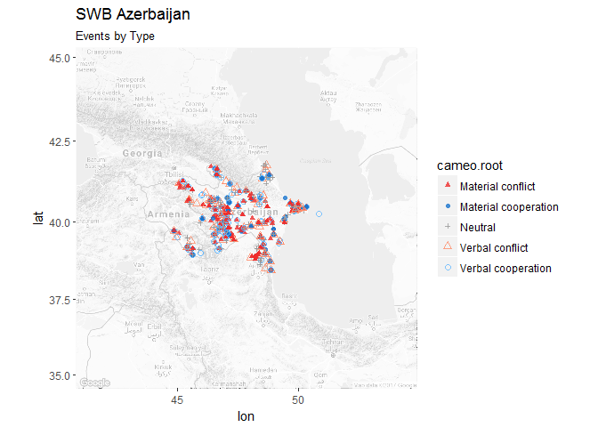
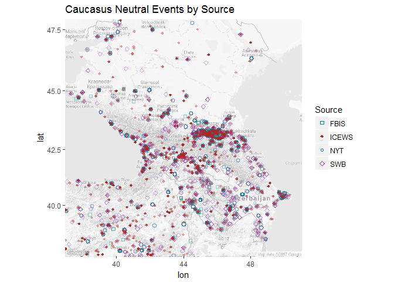

Mark\_SODA\_502\_Tutorial\_Part\_2
================
Mark Simpson
October 29, 2017

Here I'm going to show you how to make a few automated maps in R using the ICEWS and Phoenix event datasets, which we made graphs of in **Part 1**. We will use the same data and the same color scheme in order to maintain visual consistency, so that we can easily connect information between graphics.

Again, for the sake of this tutorial, I created a subset of the datasets that only contains 5 countries in the Caucasus region: Russia, Georgia, Azerbaijan, Armenia, and Turkey. Phoenix actually consists of three different subsets, New York Times (NYT), BBC Summary of World Broadcasts (SWB), and CIA Foreign Broadcast Information Service (FBIS), while Integrated Crisis Early Warning (ICEWS) is one single data set.

We need to load the data and do just a little processing with *dplyr*, just like last time.

``` r
#### Read Datasets ####

# NYT
NYT <- read.csv(file ="data/NYT.csv") %>%
  mutate(date = as.Date(date)) %>%
  mutate(Dataset = "NYT")

# SWB
SWB<- read.csv(file ="data/SWB.csv") %>%
  mutate(date = as.Date(date)) %>%
  mutate(Dataset = "SWB")

# FBIS
FBIS <- read.csv(file ="data/FBIS.csv") %>%
  mutate(date = as.Date(date)) %>%
  mutate(Dataset = "FBIS")

# ICEWS
ICEWS <- read.csv(file ="data/ICEWS.csv") %>%
  mutate(date = as.Date(date)) %>%
  mutate(Dataset = "ICEWS")
```

Next, to set up the color schemes created in Part 1

``` r
# Manually set colors for event types, called in ggmap later
event.color <- c("Neutral" = "gray60", 
          "Verbal cooperation" = "steelblue1",
          "Material cooperation"  = "dodgerblue3", 
          "Verbal conflict" = "salmon1", 
          "Material conflict" = "firebrick2")


# store our color scheme for the different sources
source.color <- c("NYT" = "dodgerblue3", 
             "SWB" = "darkorchid",
             "FBIS" = "cyan4", 
             "ICEWS" = "firebrick")
```

Mapping Event Data
------------------

Okay, so graphs are cool, but maps are neater!

*ggplot* has some limited ability to deal with geographic data. Here are the points from SWB plotted with an orthographic projection, using the ggplot *coord\_map* and *borders* function. It's not well suited the sort of fine-grained point data we have, however.

``` r
ggplot(SWB, aes(x = lon, y = lat, color = cameo.root )) +
  
  borders("world", color = "gray80", fill = "gray40") +
  
  # plot the points
  geom_point(alpha = .6) + 
     
  # Assign our color scheme
  scale_color_manual(name = "Event Type", values = event.color) +
  
  # This resent the alpha to make the legend legible
  guides(color = guide_legend(override.aes = list(alpha = 1)))+

  # ggplot map coordinate transform 
  coord_map(projection = "ortho", orientation = c( 45, 80, 0 ))  +
  
  # Change the labels to be a little intuitive
  labs( title = "SWB Events", 
        x = "Degrees East/West",
        y = "Degrees North/South")
```


### Mapping the Google Way

In order to create more detailed maps, we need more detailed data. It is possible to download all sorts of geographic data, but we can also use Google Maps service to provide us with base layers, which we can then just plot on top of.

Let's start with Georgia. First, a little setup. Within Phoenix, countries are recorded using their [ISO 3-letter codes](https://en.wikipedia.org/wiki/ISO_3166-1_alpha-3), which can be converted to the full names using a package.

``` r
# Store Georgia's country code to make things easier
country <- "GEO"

# create subset for Georgia
c.subset <- SWB %>% filter(countryname == country)

# Load countrycode package to convert country code to full name
library(countrycode, suppressPackageStartupMessages(TRUE))

# Get full name of country
long.name <- countrycode(country, "iso3c", "country.name")
```

Next, we need to load *ggmap*. We can use the points to create a bounding box which will define the extent of the map. The package warns you doing it this way is experimental, and it will break in some situations, particularly data with global coverage or geometry above 80 degrees North or South.

``` r
# Load ggmap package
library(ggmap, suppressPackageStartupMessages(TRUE))

# Get bounding box around points to pass to get_map
bbox <- make_bbox(lon, lat, c.subset, f = .5)

# Get map for bounding box from google maps service, black and white
test.map <- get_map(bbox)
```

    ## Warning: bounding box given to google - spatial extent only approximate.

    ## converting bounding box to center/zoom specification. (experimental)

    ## Map from URL : http://maps.googleapis.com/maps/api/staticmap?center=42.31665,43.178055&zoom=7&size=640x640&scale=2&maptype=terrain&language=en-EN&sensor=false

``` r
# Create map with ggmap
ggmap(test.map)
```


We can designate the source and style of the map if we want ( [see here](https://www.r-bloggers.com/google-maps-and-ggmap/) ), but for our purposes we just need something we can easily distinguish our event points from, so let's load the default map in black and white.

``` r
# Get map for bounding box from google maps service, black and white
geo.map <- get_map(bbox, color = "bw")
```

    ## Warning: bounding box given to google - spatial extent only approximate.

    ## converting bounding box to center/zoom specification. (experimental)

    ## Map from URL : http://maps.googleapis.com/maps/api/staticmap?center=42.31665,43.178055&zoom=7&size=640x640&scale=2&maptype=terrain&language=en-EN&sensor=false

``` r
# Create map with ggmap
ggmap(geo.map)
```


*ggmap* is set up to behave essentially like a ggplot object, letting us apply all our ggplot variables to the map as if it were any other plot.

To better portray the different events, let's set up more of our visual variables. We're going to be mapping the CAMEO class of each of the points, which again tells us what kind of event it is (Neutral, Verbal Cooperation/Conflict, and Material Cooperation/Conflict).

The particular visual challenge here is over-plotting of symbols, since we can expect multiple events in one recorded location (i.e., a city center).

``` r
# Manually set shapes for event types, called in ggmap later
event.shape <- c("Neutral" = 3, 
               "Verbal cooperation" = 1,
               "Material cooperation"  = 16, 
               "Verbal conflict" = 2, 
               "Material conflict" = 17)

# Manually set sizes for event types, called in ggmap later
event.size <- c("Neutral" = 1, 
                "Verbal cooperation" = 2,
                "Material cooperation"  = 1.5, 
                "Verbal conflict" = 2, 
                "Material conflict" = 1.5)
```

Cool, now let's get mapping! Note that it is really just like *ggplot*. We also have to add our visual variable mapping separately with specific functions.

``` r
# call ggmap,  tint white
ggmap(geo.map, darken = c(0.6, "white")) + 
     
     # Add points, map to variables
     geom_point(data = c.subset, 
               aes(  x = lon,
                     y = lat,
                     color = cameo.root,
                     shape = cameo.root,
                     size = cameo.root),
             alpha = .8) + 
     
     # Add size mapping
     scale_size_manual(values = event.size) +
     
     # Add color mapping
     scale_colour_manual(values = event.color) +
     
     # Add shape mapping
     scale_shape_manual(values = event.shape) +
     
     # Add label
     labs( title = paste("SWB", long.name))+
     
     # This resent the alpha to make the legend legible
     guides(color = guide_legend(override.aes = list(alpha = 1)))
```


Cool, now let's get mapping! Note that it is really just like *ggplot*. We also have to add our visual variable mapping separately with specific functions.

``` r
# call gggeo.map,  tint white
ggmap(geo.map, darken = c(0.6, "white")) + 
     
     # Add points, map to variables
     geom_point(data = c.subset, 
               aes(  x = lon,
                     y = lat,
                     color = cameo.root,
                     shape = cameo.root,
                     size = cameo.root),
             alpha = .8) + 
     
     # Add size mapping
     scale_size_manual(values = event.size) +
     
     # Add color mapping
     scale_colour_manual(values = event.color) +
     
     # Add shape mapping
     scale_shape_manual(values = event.shape) +
     
     # Add label
     labs( title = paste("SWB", long.name))+
     
     # This resent the alpha to make the legend legible
     guides(color = guide_legend(override.aes = list(alpha = 1)))
```


### Automated Cartography: Looping Maps

We can also loop this pretty easily and make a map for many countries iteratively, which is useful for these global coverage datasets. While you would want to do more customization if you were aiming to publish (the automation isn't perfect), they work great for basic visualization. Here I just use SWB, but this will work with the other datasets (ICEWS would require some renaming since the field names are different).

While we can grab the country names automatically, we have to exclude Russia since it will not be properly mapped by ggmap. Essentially, ggmap breaks with locations too far North or South, which has to do with the map projection used which has severe distortion near the poles.

Also note that this loop takes a while to run, since it has to query the Google Maps API. If you are making a series of maps, it is better to query the API for the base map, then use that base map multiple times for your different maps (i.e., within the loop). You can totally get API request denials if you query too fast and too often.

``` r
# Set as a variable, so it's easy to swap out
title.dataset <- "SWB"

# Get all the countries in the data 
countries <- as.character(unique(SWB$countryname))

# Russia's extent breaks automated mapping, sorry Russia :(
countries <- countries[countries != "RUS"]

# Start our loop
for (i in 1:length(countries)){
    
     # Assign by index, sets up everythign else
     country <- countries[i]
     
     # get full name using countrycode package
     long.name <- countrycode(country, "iso3c", "country.name")
     
     # subset dataset by country name
     c.subset <- SWB %>% filter(countryname == country)
     
     # Get bounding box, fudge factor .4
     bbox <- make_bbox(lon, lat, c.subset, f = .5)
     
     # Get map for bounding box
     map <- get_map(bbox, color = "bw")
     
     # Set subtitle
     sub <- "Events by Type"
    
    # Plots events by type
    type.map.print <- ggmap(map, darken = c(0.7, "white")) + 
         
         # Add points, map to variables
         geom_point(data = c.subset, 
                          aes(  x = lon,
                                y = lat, 
                                color = cameo.root, 
                                shape = cameo.root,
                                size = cameo.root), 
                          alpha = .8) + 
          # Add size mapping
          scale_size_manual(values = event.size) +
          
          # Add color mapping
          scale_colour_manual(values = event.color) +
          
          # Add shape mapping
          scale_shape_manual(values = event.shape) +
          
          # Add labels by combining the long.name with dataset title
          labs( title = paste(title.dataset, long.name),
              subtitle = sub) 
          
     # Print is needed to show ggplots created in loops
     print(type.map.print)

}
```

    ## converting bounding box to center/zoom specification. (experimental)

    ## Map from URL : http://maps.googleapis.com/maps/api/staticmap?center=38.968215,35.33298&zoom=5&size=640x640&scale=2&maptype=terrain&language=en-EN&sensor=false

    ## converting bounding box to center/zoom specification. (experimental)

    ## Map from URL : http://maps.googleapis.com/maps/api/staticmap?center=40.129225,47.86404&zoom=6&size=640x640&scale=2&maptype=terrain&language=en-EN&sensor=false


    ## converting bounding box to center/zoom specification. (experimental)

    ## Map from URL : http://maps.googleapis.com/maps/api/staticmap?center=40.07325,45.1096&zoom=7&size=640x640&scale=2&maptype=terrain&language=en-EN&sensor=false



    ## converting bounding box to center/zoom specification. (experimental)

    ## Map from URL : http://maps.googleapis.com/maps/api/staticmap?center=42.31665,43.178055&zoom=7&size=640x640&scale=2&maptype=terrain&language=en-EN&sensor=false


### Mapping Multiple Datasets

As with the *ggplot* histogram comparing the different datasets over time, we can do essentially the same thing with *ggmap*. This time however, let's make a map of the entire region, or as people in the biz' say, "Area of Interest" (AOI).

We can do this by first making a map that fits our desired area and then mapping our datasets on top. *ggmap* will only plot points within the map extent, so we don't have to worry about manual clipping. To find our extent, we can run get\_map by giving it coordinates for the center of our area and a zoom factor.

``` r
# Get our base map from Google, sore in variable
aoi.map <- get_map( location = c(lon = 44, lat = 43), zoom = 6, color = "bw")
```

Let's also set up a event shapes, since we'll have the same problem with over-plotting here. Note that you get several warning messages because of the points outside our map area not being plotted.

``` r
# Manually set shapes for sources
source.shape <- c("NYT" = 1, 
                  "SWB" = 5,
                  "FBIS" = 0, 
                  "ICEWS" = 18)

# Plot map, with white tint
ggmap(aoi.map, darken = c(0.6, "white")) +
     
     # Add NYT points with right color
     geom_point(data = NYT[NYT$cameo.root == "Neutral",], 
                aes(x = lon,
                    y = lat,
                    shape = "NYT",
                    color = "NYT")) +
     
     # Add SWB points with right color
     geom_point(data = SWB[SWB$cameo.root == "Neutral",], 
                aes(x = lon,
                    y = lat,
                    shape = "SWB",
                    color = "SWB")) +
     
     # FBIS points with right color
     geom_point(data = FBIS[FBIS$cameo.root == "Neutral",],
                aes(x = lon,
                    y = lat,
                    shape = "FBIS",
                    color = "FBIS")) +
     
     # ICEWS: Note cameo field abd location names are different
     geom_point(data = ICEWS[ICEWS$cameo.root == "Neutral",], 
                aes(x = Longitude,
                    y = Latitude,
                    shape = "ICEWS",
                    color = "ICEWS")) +
        
     # Assign source colors, defined earlier
     scale_color_manual(name = "Source", values = source.color ) +
     
     # Add shape mapping
     scale_shape_manual( name = "Source", values = source.shape ) +
     
     # Add label
     labs( title = "Caucasus Neutral Events by Source" )
```



### Mean Center Madness

A very simple spatial analysis method is to compare the [mean center](http://desktop.arcgis.com/en/arcmap/10.3/tools/spatial-statistics-toolbox/h-how-mean-center-spatial-statistics-works.htm) of a collection of objects. This is simply the average location in x and y (latitude and longitude), showing us the general trend of where most of our data is located. In our case this is useful since we have a lot of points, many of which are perfectly overlapping and therefore impossible to count visually.

With some judicious indexing in the `data` field, we can map the mean center for each country, for each event type, and for each time period. Since we already have the GEO map stored as a variable, we can keep using it as many times as we need to without worrying and over-querying the Google Maps API (again, important for looping).

``` r
country.name <- "GEO"

# Store point shape/size/alpha since we have to call this per point
point.size <- 3
point.shape <- 18


# Plot map, with white tint
ggmap(geo.map, darken = c(0.6, "white") ) +

     # Plot Georgia's mean center for NYT
     geom_point(data = NYT[NYT$countryname == country.name,], 
                aes(x = mean(lon), 
                    y = mean(lat),
                    color = "NYT",
                    fill = "NYT"),
                size = point.size,
                shape = point.shape) +

     # Plot Georgia's mean center for SWB
     geom_point(data = SWB[SWB$countryname == country.name,],
                aes(x = mean(lon),
                    y = mean(lat),
                    color = "SWB",
                    fill = "SWB"),
                size = point.size,
                shape = point.shape) +

     # Plot Georgia's mean center for FBIS
     geom_point(data = FBIS[FBIS$countryname == country.name,],
                aes(x = mean(lon),
                    y = mean(lat),
                    color = "FBIS",
                    fill = "FBIS"),
                size = point.size,
                shape = point.shape) +

     # Plot Georgia's mean center for ICEWS
     geom_point(data = ICEWS[ICEWS$countryname == country.name,],
                aes(x = mean(Longitude),
                    y = mean(Latitude),
                    color = "ICEWS",
                    fill = "ICEWS"),
                size = point.size,
                shape = point.shape) +
     
     # Assign source colors, defined earlier
     scale_color_manual(name = "Source", values = source.color ) +
     
     # Assign source colors to fill, which is a separate value
     scale_fill_manual(name = "Source", values = source.color) +

     # Add labels
     labs( title = "Caucasus Events Mean Center by Source" )
```


Note that while there are differences overall might be due to some sort of bias in the collection by the source, we're ignoring an important aspect: *time*. Each data set has a different span of temporal coverage, so let's make the same map, but filtered by time. Let's go ahead and store that as a variable so we can access it later.

``` r
# Plot map, with white tint
mean.geo.map <- ggmap(geo.map, darken = c(0.6, "white") ) +

     # Plot Georgia's mean center for NYT
     geom_point(data = NYT[(NYT$countryname == country.name) &
                                (NYT$date > "1995-01-01") &
                                (NYT$date < "2004-01-01"), ],
                aes(x = mean(lon),
                    y = mean(lat),
                    color = "NYT",
                    fill = "NYT"),
                size = point.size,
                shape = point.shape) +

     # Plot Georgia's mean center for SWB, apparently some NA's snuck in
     geom_point(data = SWB[(SWB$countryname == country.name) 
                           & (SWB$date > "1995-01-01") 
                           & (SWB$date < "2004-01-01"), ],
                aes(x = mean(lon, na.rm = TRUE),
                    y = mean(lat, na.rm = TRUE),
                    color = "SWB",
                    fill = "SWB"),
                size = point.size,
                shape = point.shape) +

     # Plot Georgia's mean center for FBIS
     geom_point(data = FBIS[FBIS$countryname == country.name&
                                (FBIS$date > "1995-01-01") &
                                (FBIS$date < "2004-01-01"), ],
                aes(x = mean(lon),
                    y = mean(lat),
                    color = "FBIS",
                    fill = "FBIS"),
                size = point.size,
                shape = point.shape) +

     # Plot Georgia's mean center for ICEWS
     geom_point(data = ICEWS[ICEWS$countryname == country.name&
                                (ICEWS$date > "1995-01-01") &
                                (ICEWS$date < "2004-01-01"), ],
                aes(x = mean(Longitude),
                    y = mean(Latitude),
                    color = "ICEWS",
                    fill = "ICEWS"),
                size = point.size,
                shape = point.shape) +
     
     # Assign source colors, defined earlier
     scale_color_manual(name = "Source", values = source.color ) +
     
     # Assign source colors to fill, which is a separate value
     scale_fill_manual(name = "Source", values = source.color) +

     # Add labels
     labs( title = "Caucasus Events 1995-2004 Mean Center by Source" )
```

Interestingly, ICEWS is most similar to FBIS, and both are closer to the capital, Tbilisi.

We can also split up the data by event type, again by some more indexing. The indexing is getting rather gnarly at this point, so in practice it's better to subset your data just for the sake of debugging.

Let's take a look at Material Conflict, and let's plot it on top of the the previous map so we can see how the mean center shifts by attribute.

``` r
# Shape to distinguish from old points, triangle as used for material conflict
point.shape.2 <- 2

# Plot map, with white tint
mean.geo.map +

     # Plot Georgia's mean center for NYT
     geom_point(data = NYT[(NYT$countryname == country.name) &
                                (NYT$date > "1995-01-01") &
                                (NYT$date < "2004-01-01") &
                                (NYT$cameo.root == "Material conflict"), ],
                aes(x = mean(lon),
                    y = mean(lat),
                    color = "NYT",
                    fill = "NYT"),
                size = point.size,
                shape = point.shape.2) +

     # Plot Georgia's mean center for SWB, apparently some NA's snuck in
     geom_point(data = SWB[(SWB$countryname == country.name) &
                                (SWB$date > "1995-01-01") &
                                (SWB$date < "2004-01-01") &
                                (SWB$cameo.root == "Material conflict"), ],
                aes(x = mean(lon, na.rm = TRUE),
                    y = mean(lat, na.rm = TRUE),
                    color = "SWB",
                    fill = "SWB"),
                size = point.size,
                shape = point.shape.2) +

     # Plot Georgia's mean center for FBIS
     geom_point(data = FBIS[FBIS$countryname == country.name &
                                (FBIS$date > "1995-01-01") &
                                (FBIS$date < "2004-01-01") &
                                (FBIS$cameo.root == "Material conflict"), ],
                aes(x = mean(lon),
                    y = mean(lat),
                    color = "FBIS",
                    fill = "FBIS"),
                size = point.size,
                shape = point.shape.2) +

     # Plot Georgia's mean center for ICEWS
     geom_point(data = ICEWS[ICEWS$countryname == country.name &
                                (ICEWS$date > "1995-01-01") &
                                (ICEWS$date < "2004-01-01") &
                                (ICEWS$cameo.root == "Material conflict"), ],
                aes(x = mean(Longitude),
                    y = mean(Latitude),
                    color = "ICEWS",
                    fill = "ICEWS"),
                size = point.size,
                shape = point.shape.2) +
     
     # Add labels
     labs( title = "Material Conflicts 1995-2004, Mean Center by Source" )
```


ICEWS is most similar to FBIS, but now NYT and SWB are closer together, and we can see a visible shift away from the capital when we consider only Material conflict events, towards Russia. I wonder why? Oh, it's because it's Russia.

Conclusion
----------

There are obviously a lot of different combinations of attributes, sources, and time periods we can map, and I didn't cover them all. Making maps like these can be mostly automated, though there are issues with the current implementation of *ggmap*. For example, some countries only have events at a single location, due to the way the geoparsing finds locations, which makes finding a bounding box automatically fail, which causes the maps to fail. Finding countries by their names is also unreliable since the default zoom is much to close to display some countries in their entirety (like Russia).

Future work includes trying to find a graceful workaround for the above issues, and implementing the creation of some of these analysis maps in a more automated way. I am also working on creating global-level maps, which involves reading in shapefiles and combining them with generated summary tables, but is something I did not have time to include here.

Overall, I hope you learned something, and happy mapping!
